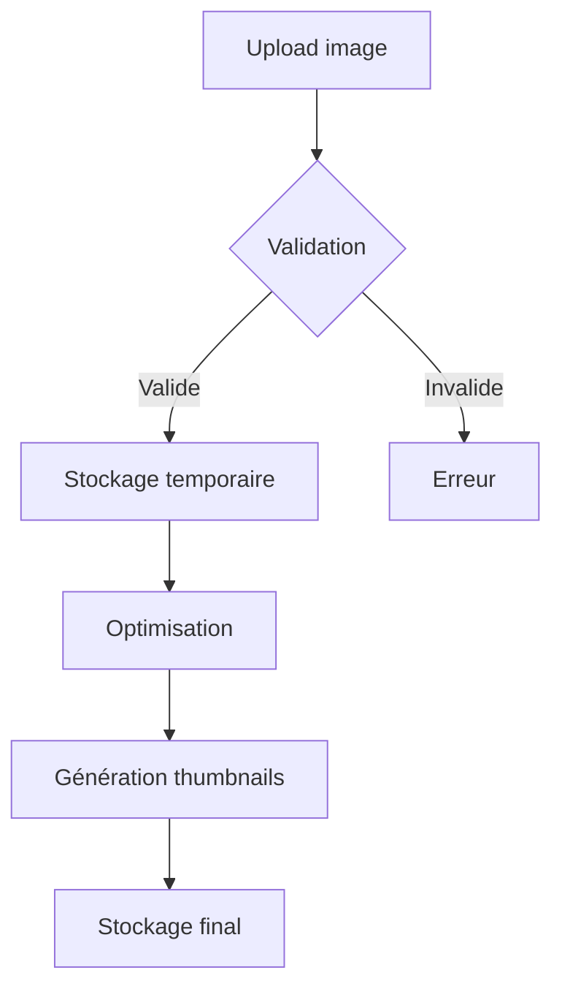

# Gestion des Images - Documentation Technique

## Table des matières
1. [Vue d'ensemble](#vue-densemble)
2. [Architecture](#architecture)
3. [Services](#services)
4. [Modèles](#modèles)
5. [Stockage](#stockage)
6. [Formats et Dimensions](#formats-et-dimensions)
7. [Utilisation](#utilisation)
8. [Bonnes pratiques](#bonnes-pratiques)
9. [Workflow de gestion des images](#workflow-de-gestion-des-images)
10. [Intégration avec Inertia.js](#intégration-avec-inertiajs)
11. [Tests et Validation](#tests-et-validation)
12. [Maintenance et Monitoring](#maintenance-et-monitoring)

## Vue d'ensemble

Le système de gestion d'images est une composante essentielle de notre marketplace de ressourceries. Il est conçu pour :
- Gérer efficacement les images des produits d'occasion
- Assurer une présentation optimale des produits
- Minimiser l'utilisation de la bande passante
- Optimiser le stockage
- Faciliter le travail des ressourceries

### Fonctionnalités principales
- Upload multiple d'images
- Génération automatique de miniatures optimisées
- Conversion automatique en WebP pour de meilleures performances
- Ordonnancement des images (image principale, galerie)
- Gestion des métadonnées (dimensions, format, qualité)
- Nettoyage automatique des images orphelines
- Interface intuitive pour les ressourceries

## Architecture

### Structure des fichiers
```
app/
├── Models/
│   ├── Product.php              # Modèle de produit avec relation images
│   └── ProductImage.php         # Modèle de gestion des images
├── Services/
│   ├── ImageService.php         # Service de manipulation d'images
│   └── ProductImageService.php  # Service de gestion des images produits
├── Http/
│   ├── Controllers/
│   │   └── Ressourcerie/
│   │       └── ProductController.php  # Gestion des produits ressourcerie
│   └── Requests/
│       └── ProductRequest.php   # Validation des requêtes produits
└── storage/
    └── app/
        └── public/
            └── products/        # Stockage des images
                ├── originals/   # Images originales
                └── thumbnails/  # Miniatures générées
```

### Base de données
La table `product_images` est optimisée pour notre marketplace :
```sql
CREATE TABLE product_images (
    id BIGINT UNSIGNED AUTO_INCREMENT PRIMARY KEY,
    product_id BIGINT UNSIGNED NOT NULL,
    path VARCHAR(255) NOT NULL,
    thumbnails JSON,
    order INT UNSIGNED DEFAULT 0,
    created_at TIMESTAMP NULL DEFAULT NULL,
    updated_at TIMESTAMP NULL DEFAULT NULL,
    FOREIGN KEY (product_id) REFERENCES market__products(id) ON DELETE CASCADE
);
```

#### Structure du JSON thumbnails
```json
{
    "thumb": {
        "path": "products/product-abc123-thumb.webp",
        "width": 150,
        "height": 150,
        "size": 15000
    },
    "medium": {
        "path": "products/product-abc123-medium.webp",
        "width": 300,
        "height": 300,
        "size": 45000
    },
    "large": {
        "path": "products/product-abc123-large.webp",
        "width": 800,
        "height": 800,
        "size": 150000
    }
}
```

## Services

### ImageService

Le service `ImageService` est spécialement conçu pour notre marketplace de ressourceries :

#### Configuration
```php
private const ALLOWED_FORMATS = ['jpg', 'jpeg', 'png', 'webp'];
private const DEFAULT_QUALITY = 80;
private const DEFAULT_FORMAT = 'webp';
private const IMAGE_SIZES = [
    'thumb' => ['width' => 150, 'height' => 150],
    'medium' => ['width' => 300, 'height' => 300],
    'large' => ['width' => 800, 'height' => 800],
];
```

#### Optimisations spécifiques
- Compression adaptative selon le type de produit
- Maintien des métadonnées importantes (EXIF si pertinent)
- Génération de noms uniques pour éviter les conflits
- Nettoyage des métadonnées sensibles

### ProductImageService

Service dédié à la gestion des images de produits dans le contexte des ressourceries :

#### Fonctionnalités avancées
```php
class ProductImageService
{
    // Ajout d'images avec validation du contexte ressourcerie
    public function addImages(Product $product, array $images, int $startOrder = 0): void
    {
        $this->validateRessourcerieContext($product);
        // ... logique d'ajout
    }

    // Réorganisation avec vérification des permissions
    public function reorderImages(Product $product, array $imageIds): void
    {
        $this->validateRessourcerieOwnership($product);
        // ... logique de réorganisation
    }

    // Nettoyage intelligent des images
    public function cleanupOrphanedImages(): int
    {
        // ... logique de nettoyage
    }
}
```

## Workflow de gestion des images

### 1. Upload d'images


### 2. Processus de validation
- Vérification du format
- Validation des dimensions
- Contrôle de la taille
- Scan antivirus
- Vérification des permissions

### 3. Optimisation
1. Conversion en WebP
2. Compression intelligente
3. Génération des miniatures
4. Stockage des métadonnées

## Intégration avec Inertia.js

### Composant de upload
```jsx
const ImageUpload = ({ onUpload }) => {
    const { data, setData, post, processing, errors } = useForm({
        images: [],
    });

    const handleUpload = async (e) => {
        const files = Array.from(e.target.files);
        setData('images', files);
        
        await post(route('ressourcerie.products.upload-images'), {
            onSuccess: () => {
                // Gérer le succès
            },
        });
    };

    return (
        <div className="mt-4">
            <input
                type="file"
                multiple
                onChange={handleUpload}
                accept="image/*"
                className="file-input"
            />
            {errors.images && (
                <div className="text-red-500">{errors.images}</div>
            )}
        </div>
    );
};
```

### Gestion des prévisualisations
```jsx
const ImagePreview = ({ images, onDelete, onReorder }) => {
    return (
        <div className="grid grid-cols-4 gap-4">
            {images.map((image, index) => (
                <div key={image.id} className="relative group">
                    
                    <div className="absolute top-0 right-0 p-2">
                        <button
                            onClick={() => onDelete(image.id)}
                            className="bg-red-500 text-white rounded-full p-1"
                        >
                            <TrashIcon className="w-4 h-4" />
                        </button>
                    </div>
                </div>
            ))}
        </div>
    );
};
```

## Tests et Validation

### Tests unitaires
```php
class ImageServiceTest extends TestCase
{
    public function test_image_upload_and_thumbnail_generation()
    {
        // Arrange
        $file = UploadedFile::fake()->image('product.jpg');
        
        // Act
        $result = $this->imageService->handleUpload($file);
        
        // Assert
        $this->assertArrayHasKey('thumbnails', $result);
        $this->assertFileExists(storage_path('app/public/' . $result['path']));
    }
}
```

### Tests d'intégration
```php
class ProductImageManagementTest extends TestCase
{
    public function test_ressourcerie_can_manage_product_images()
    {
        // Arrange
        $ressourcerie = Ressourcerie::factory()->create();
        $product = Product::factory()->create(['ressourcerie_id' => $ressourcerie->id]);
        
        // Act & Assert
        $this->actingAs($ressourcerie->user)
            ->post(route('ressourcerie.products.images.store', $product->id), [
                'images' => [
                    UploadedFile::fake()->image('product1.jpg'),
                    UploadedFile::fake()->image('product2.jpg'),
                ]
            ])
            ->assertSuccessful();
            
        $this->assertEquals(2, $product->fresh()->images()->count());
    }
}
```

## Maintenance et Monitoring

### Tâches planifiées
```php
// app/Console/Kernel.php
protected function schedule(Schedule $schedule)
{
    // Nettoyage quotidien des images orphelines
    $schedule->command('images:cleanup')->daily();
    
    // Optimisation hebdomadaire du stockage
    $schedule->command('images:optimize')->weekly();
    
    // Vérification de l'intégrité des images
    $schedule->command('images:verify')->daily();
}
```

### Monitoring
- Surveillance de l'espace disque
- Suivi des performances de conversion
- Alertes en cas d'erreurs d'upload
- Statistiques d'utilisation

### Maintenance
1. Nettoyage régulier des fichiers temporaires
2. Vérification de l'intégrité des images
3. Optimisation périodique du stockage
4. Sauvegarde des images originales

## Bonnes pratiques

### Sécurité
1. **Validation stricte**
   - Types MIME autorisés
   - Taille maximale : 2MB
   - Dimensions raisonnables
   - Scan antivirus

2. **Stockage sécurisé**
   - Noms de fichiers uniques
   - Permissions restrictives
   - Isolation des uploads

### Performance
1. **Optimisation des images**
   - Compression WebP
   - Redimensionnement adaptatif
   - Lazy loading

2. **Mise en cache**
   - Cache HTTP
   - Cache des miniatures
   - Cache des métadonnées

### Interface utilisateur
1. **Upload intuitif**
   - Drag & drop
   - Prévisualisation immédiate
   - Barre de progression

2. **Gestion des erreurs**
   - Messages clairs
   - Solutions proposées
   - Logs détaillés 