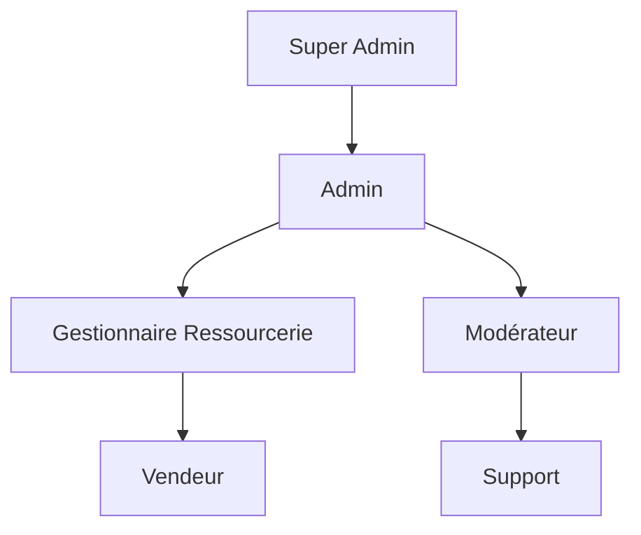

# 🔐 Système de Permissions

Le système de permissions de la Marketplace utilise une approche RBAC (Role-Based Access Control) avancée, combinée avec des permissions granulaires.

## Vue d'ensemble

### Structure des permissions


## Rôles principaux

### 1. Super Admin
- Accès complet au système
- Gestion des administrateurs
- Configuration système
- Audit des actions

### 2. Admin
- Gestion des ressourceries
- Modération des contenus
- Gestion des utilisateurs
- Rapports et statistiques

### 3. Gestionnaire Ressourcerie
- Gestion de sa ressourcerie
- Gestion des produits
- Accès aux statistiques
- Gestion des vendeurs

### 4. Vendeur
- Ajout/modification de produits
- Gestion des commandes
- Statistiques basiques

## Implémentation

### Configuration des rôles
```php
// config/permissions.php
return [
    'roles' => [
        'super_admin' => [
            'name' => 'Super Administrateur',
            'permissions' => '*',
        ],
        'admin' => [
            'name' => 'Administrateur',
            'permissions' => [
                'manage_stores',
                'manage_users',
                'view_statistics',
                // ...
            ],
        ],
        // ...
    ],
];
```

### Middleware de vérification
```php
// app/Http/Middleware/CheckPermission.php
public function handle($request, Closure $next, $permission)
{
    if (!$request->user()->hasPermission($permission)) {
        throw new UnauthorizedException();
    }
    
    return $next($request);
}
```

### Utilisation dans les routes
```php
Route::middleware(['auth', 'permission:manage_stores'])->group(function () {
    Route::get('/stores', [StoreController::class, 'index']);
    Route::post('/stores', [StoreController::class, 'store']);
    // ...
});
```

## Permissions granulaires

### Ressourceries
```php
'store_permissions' => [
    'view_store',
    'edit_store',
    'manage_products',
    'view_statistics',
    'manage_staff',
    'manage_settings',
]
```

### Produits
```php
'product_permissions' => [
    'create_product',
    'edit_product',
    'delete_product',
    'manage_inventory',
    'set_prices',
]
```

### Utilisateurs
```php
'user_permissions' => [
    'create_user',
    'edit_user',
    'delete_user',
    'assign_roles',
]
```

## Vérification des permissions

### Dans les contrôleurs
```php
public function update(Store $store)
{
    $this->authorize('edit_store', $store);
    // ...
}
```

### Dans les vues
```php
@can('edit_store', $store)
    <button>Modifier</button>
@endcan
```

### Dans React
```jsx
import { usePermissions } from '@/hooks/usePermissions';

const StoreManager = () => {
    const { can } = usePermissions();

    return (
        <div>
            {can('edit_store') && (
                <button>Modifier</button>
            )}
        </div>
    );
};
```

## Audit et Logs

### Enregistrement des actions
```php
// app/Services/AuditService.php
public function logAction($user, $action, $resource)
{
    AuditLog::create([
        'user_id' => $user->id,
        'action' => $action,
        'resource_type' => get_class($resource),
        'resource_id' => $resource->id,
        'details' => $this->getActionDetails(),
    ]);
}
```

### Exemple d'utilisation
```php
public function deleteStore(Store $store)
{
    $this->authorize('delete_store', $store);
    
    $store->delete();
    
    app(AuditService::class)->logAction(
        auth()->user(),
        'delete_store',
        $store
    );
}
```

## Bonnes pratiques

### Sécurité
- Vérifiez toujours les permissions avant chaque action
- Utilisez les middleware pour les routes
- Implémentez une politique de mot de passe fort
- Activez l'authentification à deux facteurs

### Performance
- Mettez en cache les permissions
- Optimisez les requêtes de vérification
- Utilisez des index sur les tables de permissions

### Maintenance
- Documentez les changements de permissions
- Auditez régulièrement les accès
- Revoyez périodiquement les rôles

## Dépannage

### Problèmes courants

1. **Permissions non appliquées**
```php
php artisan cache:clear
php artisan permission:cache-reset
```

2. **Conflits de rôles**
```php
// Vérifiez les priorités
Role::fixTree();
```

::: tip Conseil
Utilisez toujours les gates et les policies plutôt que de vérifier les permissions directement.
:::

::: warning Important
Les permissions sont hiérarchiques. Un rôle supérieur hérite des permissions des rôles inférieurs.
:::

## Ressources additionnelles

- [Guide de sécurité](../security/index.md)
- [Documentation API des permissions](../api/permissions.md)
- [Gestion des rôles](./roles.md)
- [Audit et logs](./audit.md)

# Système de Permissions et Rôles

::: tip Note
Cette documentation détaille le système complet de gestion des permissions et des rôles de l'application.
:::

## Vue d'ensemble

<div class="custom-block">
  <p><strong>3 niveaux de rôles</strong> avec des permissions distinctes :</p>
  <div class="roles-grid">
    <div class="role-card admin">
      <h3>👑 Administrateur</h3>
      <p>Accès complet au système</p>
    </div>
    <div class="role-card ressourcerie">
      <h3>🏪 Ressourcerie</h3>
      <p>Gestion de ressourcerie</p>
    </div>
    <div class="role-card client">
      <h3>👤 Client</h3>
      <p>Utilisateur standard</p>
    </div>
  </div>
</div>

## Permissions détaillées

### Administrateur

::: details Voir toutes les permissions administrateur
| Fonctionnalité | Accès | Description |
|----------------|--------|-------------|
| Dashboard admin | ✅ | Accès complet au tableau de bord administrateur |
| Gestion utilisateurs | ✅ | Création, modification et suppression des utilisateurs |
| Gestion catégories | ✅ | Gestion complète de l'arborescence des catégories |
| Gestion produits | ✅ | Supervision de tous les produits |
| Gestion commandes | ✅ | Vue globale et gestion des commandes |
| Documentation | ✅ | Accès à la documentation technique |
| Statistiques | ✅ | Accès aux analyses et rapports |
| Gestion ressourceries | ✅ | Administration des ressourceries |
:::

### Ressourcerie

::: details Voir les permissions ressourcerie
| Fonctionnalité | Accès | Description |
|----------------|--------|-------------|
| Dashboard ressourcerie | ✅ | Tableau de bord spécifique ressourcerie |
| Gestion produits | ✅ | Gestion des produits de la ressourcerie |
| Vue commandes | ✅ | Visualisation des commandes liées |
| Gestion profil | ✅ | Modification du profil ressourcerie |
| Admin global | ❌ | Pas d'accès à l'administration générale |
| Gestion catégories | ❌ | Pas de gestion des catégories |
| Autres ressourceries | ❌ | Pas d'accès aux autres ressourceries |
:::

### Client

::: details Voir les permissions client
| Fonctionnalité | Accès | Description |
|----------------|--------|-------------|
| Catalogue | ✅ | Accès au catalogue produits |
| Panier | ✅ | Gestion du panier d'achats |
| Commandes | ✅ | Passage et suivi des commandes |
| Favoris | ✅ | Gestion des favoris |
| Profil | ✅ | Gestion du profil client |
| Dashboards | ❌ | Pas d'accès aux tableaux de bord |
| Gestion produits | ❌ | Pas de gestion des produits |
:::

## Implémentation technique

### Configuration des Gates

::: code-group
```php [AuthServiceProvider.php]
// 📁 app/Providers/AuthServiceProvider.php

class AuthServiceProvider extends ServiceProvider
{
    public function boot()
    {
        // Rôles de base
        Gate::define('admin', fn (User $user) => $user->role === 'admin');
        Gate::define('ressourcerie', fn (User $user) => $user->role === 'ressourcerie');
        Gate::define('client', fn (User $user) => $user->role === 'client');

        // Permissions spécifiques
        Gate::define('access-admin', fn (User $user) => $user->role === 'admin');
        Gate::define('manage-products', fn (User $user) => 
            in_array($user->role, ['admin', 'ressourcerie'])
        );
        Gate::define('view-orders', fn (User $user) => 
            in_array($user->role, ['admin', 'ressourcerie', 'client'])
        );
    }
}
```

```php [RoleController.php]
// 📁 app/Http/Controllers/Auth/RoleController.php

class RoleController extends Controller
{
    public function switchToRessourcerie(Request $request)
    {
        $user = $request->user();
        $user->role = 'ressourcerie';
        $user->save();
        
        return redirect()->back()->with('status', 'Rôle mis à jour');
    }
}
```

```jsx [Navigation.jsx]
// 📁 resources/js/Components/Navigation.jsx

export default function Navigation() {
    const { permissions } = usePage().props;

    return (
        <nav>
            {permissions?.canManageProducts && (
                <Link href={route('products.create')}>
                    Créer un Produit
                </Link>
            )}
        </nav>
    );
}
```
:::

### Middleware Inertia

::: warning Important
Les permissions sont automatiquement partagées avec le frontend via le middleware Inertia.
:::

```php
// 📁 app/Http/Middleware/HandleInertiaRequests.php

public function share(Request $request): array
{
    return [
        'permissions' => [
            'canAccessAdmin' => $request->user()?->can('access-admin'),
            'canManageProducts' => $request->user()?->can('manage-products'),
            'canViewOrders' => $request->user()?->can('view-orders'),
        ]
    ];
}
```

## Bonnes pratiques

::: tip Sécurité
1. Toujours vérifier les permissions côté serveur
2. Ne pas faire confiance uniquement aux vérifications frontend
3. Utiliser les middleware d'autorisation
:::

### Exemple de protection des routes

```php
Route::middleware(['auth', 'can:access-admin'])->group(function () {
    Route::get('/admin/dashboard', [AdminController::class, 'dashboard']);
    Route::resource('categories', CategoryController::class);
});
```

### Tests recommandés

```php
class PermissionTest extends TestCase
{
    public function test_only_admin_can_access_dashboard()
    {
        $admin = User::factory()->create(['role' => 'admin']);
        $client = User::factory()->create(['role' => 'client']);

        $this->actingAs($admin)
            ->get('/admin/dashboard')
            ->assertStatus(200);

        $this->actingAs($client)
            ->get('/admin/dashboard')
            ->assertStatus(403);
    }
}
```

<style>
.roles-grid {
    display: grid;
    grid-template-columns: repeat(auto-fit, minmax(200px, 1fr));
    gap: 1rem;
    margin: 2rem 0;
}

.role-card {
    padding: 1rem;
    border-radius: 8px;
    box-shadow: 0 2px 4px rgba(0,0,0,0.1);
}

.role-card.admin {
    background: linear-gradient(135deg, #4f46e5 0%, #7c3aed 100%);
    color: white;
}

.role-card.ressourcerie {
    background: linear-gradient(135deg, #059669 0%, #10b981 100%);
    color: white;
}

.role-card.client {
    background: linear-gradient(135deg, #2563eb 0%, #3b82f6 100%);
    color: white;
}

.custom-block {
    margin: 1rem 0;
    padding: 1rem;
    border-radius: 8px;
    background: #f8fafc;
}
</style> 