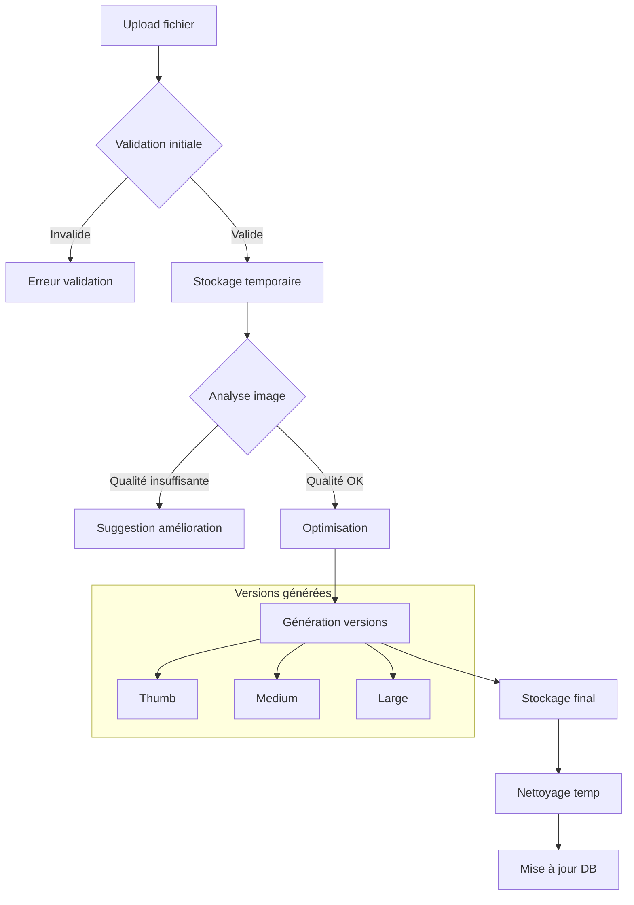
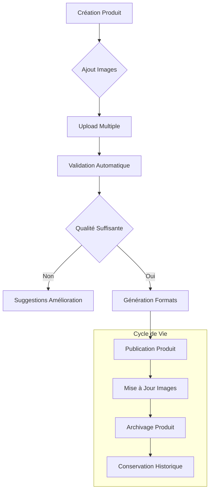

# 🖼️ Système de Gestion des Images

::: tip Introduction
Cette documentation détaille le système complet de gestion des images de la marketplace, spécialement conçu pour les besoins des ressourceries.
:::

## 📋 Table des matières

[[toc]]

## 🎯 Vue d'ensemble

<div class="features-grid">
  <div class="feature-card upload">
    <h3>📤 Upload intelligent</h3>
    <ul>
      <li>Upload multiple</li>
      <li>Validation automatique</li>
      <li>Prévisualisation instantanée</li>
    </ul>
  </div>
  
  <div class="feature-card optimization">
    <h3>⚡ Optimisation</h3>
    <ul>
      <li>Compression adaptative</li>
      <li>Conversion WebP</li>
      <li>Redimensionnement auto</li>
    </ul>
  </div>
  
  <div class="feature-card security">
    <h3>🔒 Sécurité</h3>
    <ul>
      <li>Validation MIME</li>
      <li>Scan antivirus</li>
      <li>Nettoyage métadonnées</li>
    </ul>
  </div>
</div>

### Fonctionnalités clés pour les ressourceries

::: info Spécificités métier
- **Gestion efficace des produits d'occasion**
  - Upload multiple pour gagner du temps
  - Interface intuitive adaptée aux besoins
  - Prévisualisation immédiate des images

- **Optimisation pour le e-commerce**
  - Génération automatique des formats nécessaires
  - Compression intelligente selon le type de produit
  - Mise en avant des détails importants

- **Gestion de la qualité**
  - Validation des dimensions minimales
  - Vérification de la netteté
  - Suggestions d'amélioration automatiques
:::

## 📁 Architecture

### Structure des fichiers

::: code-group
```bash [Structure]
app/
├── Models/
│   ├── Product.php           # Modèle produit
│   └── ProductImage.php      # Modèle image
├── Services/
│   ├── ImageService.php      # Service principal
│   └── ProductImageService.php # Service spécifique
└── storage/
    └── app/
        └── public/
            └── products/     # Stockage images
                ├── originals/
                └── thumbnails/
```

```php [Product.php]
class Product extends Model
{
    public function images()
    {
        return $this->hasMany(ProductImage::class)
            ->orderBy('order');
    }

    public function mainImage()
    {
        return $this->hasOne(ProductImage::class)
            ->where('order', 1);
    }
}
```

```php [ProductImage.php]
class ProductImage extends Model
{
    protected $casts = [
        'thumbnails' => 'array',
        'metadata' => 'array',
        'order' => 'integer',
    ];

    protected $fillable = [
        'path',
        'thumbnails',
        'metadata',
        'order',
    ];
}
```
:::

### Base de données

::: details Voir le schéma de la base de données
```sql
CREATE TABLE product_images (
    id BIGINT UNSIGNED AUTO_INCREMENT PRIMARY KEY,
    product_id BIGINT UNSIGNED NOT NULL,
    path VARCHAR(255) NOT NULL,
    thumbnails JSON,
    metadata JSON,
    order INT UNSIGNED DEFAULT 0,
    created_at TIMESTAMP NULL DEFAULT NULL,
    updated_at TIMESTAMP NULL DEFAULT NULL,
    FOREIGN KEY (product_id) REFERENCES products(id) ON DELETE CASCADE
);
```

Structure du JSON `thumbnails` :
```json
{
    "thumb": {
        "path": "products/abc123-thumb.webp",
        "width": 150,
        "height": 150,
        "size": 15000
    },
    "medium": {
        "path": "products/abc123-medium.webp",
        "width": 300,
        "height": 300,
        "size": 45000
    },
    "large": {
        "path": "products/abc123-large.webp",
        "width": 800,
        "height": 800,
        "size": 150000
    }
}
```
:::

### Workflow détaillé

::: details Voir le workflow complet

:::

## 💾 Stockage et Performance

::: warning Gestion du stockage
- **Structure des dossiers**
  ```bash
  storage/
  ├── app/
  │   └── public/
  │       └── products/
  │           ├── originals/    # Images originales
  │           ├── thumbnails/   # Miniatures
  │           └── temp/         # Stockage temporaire
  ```

- **Politique de nettoyage**
  - Suppression automatique des fichiers temporaires après 24h
  - Nettoyage hebdomadaire des images orphelines
  - Compression périodique des images peu consultées
:::

### Optimisation des performances

::: tip Stratégies d'optimisation
1. **Mise en cache**
   - Cache HTTP avec ETag
   - Cache des miniatures
   - Cache des métadonnées

2. **Chargement intelligent**
   - Lazy loading des images
   - Chargement progressif
   - Préchargement sélectif

3. **CDN et distribution**
   - Intégration avec Cloudflare
   - Cache géographique
   - Optimisation automatique
:::

## 🔧 Intégration technique

### Configuration avancée

::: code-group
```php [config/images.php]
return [
    'formats' => [
        'allowed' => ['jpg', 'jpeg', 'png', 'webp'],
        'default_output' => 'webp',
    ],
    'sizes' => [
        'thumb' => ['width' => 150, 'height' => 150, 'quality' => 80],
        'medium' => ['width' => 300, 'height' => 300, 'quality' => 85],
        'large' => ['width' => 800, 'height' => 800, 'quality' => 90],
    ],
    'storage' => [
        'disk' => 'public',
        'max_size' => 2048, // KB
        'path' => 'products',
    ],
    'optimization' => [
        'compression' => true,
        'strip_metadata' => true,
        'preserve_quality' => true,
    ],
];
```

```php [ImageService.php]
public function optimizeForProduct(string $path, string $productType): void
{
    $settings = $this->getOptimizationSettings($productType);
    $this->optimizer->optimize($path, $settings);
}

private function getOptimizationSettings(string $productType): array
{
    return match($productType) {
        'clothing' => ['focus' => 'texture', 'quality' => 90],
        'furniture' => ['focus' => 'detail', 'quality' => 85],
        default => ['focus' => 'balanced', 'quality' => 80],
    };
}
```
:::

## 🎯 Composants React

### Upload d'images

::: code-group
```jsx [ImageUpload.jsx]
const ImageUpload = ({ onUpload }) => {
    const { data, setData, post, processing } = useForm({
        images: []
    });

    const handleUpload = async (e) => {
        const files = Array.from(e.target.files);
        setData('images', files);
        
        await post(route('ressourcerie.products.images.store'), {
            onSuccess: () => {
                toast.success('Images téléchargées avec succès');
                onUpload?.();
            }
        });
    };

    return (
        <div className="upload-zone">
            <input
                type="file"
                multiple
                onChange={handleUpload}
                accept="image/*"
                disabled={processing}
            />
            {processing && <LoadingSpinner />}
        </div>
    );
};
```

```jsx [ImageGallery.jsx]
const ImageGallery = ({ images, onReorder, onDelete }) => {
    return (
        <div className="grid grid-cols-4 gap-4">
            {images.map((image, index) => (
                <div key={image.id} className="relative group">
                    
                    <div className="absolute top-2 right-2 opacity-0 group-hover:opacity-100">
                        <button onClick={() => onDelete(image.id)}>
                            <TrashIcon className="w-5 h-5 text-red-500" />
                        </button>
                    </div>
                </div>
            ))}
        </div>
    );
};
```
:::

## 🧪 Tests

### Tests unitaires

::: code-group
```php [ImageServiceTest.php]
class ImageServiceTest extends TestCase
{
    /** @test */
    public function it_can_handle_image_upload()
    {
        // Arrange
        $file = UploadedFile::fake()->image('test.jpg');
        
        // Act
        $result = $this->imageService->handleUpload($file, 'products');
        
        // Assert
        $this->assertArrayHasKey('thumbnails', $result);
        $this->assertCount(3, $result['thumbnails']);
        Storage::disk('public')->assertExists($result['path']);
    }

    /** @test */
    public function it_validates_image_size()
    {
        $this->expectException(ImageValidationException::class);
        
        $file = UploadedFile::fake()->image('large.jpg')->size(3000);
        $this->imageService->handleUpload($file, 'products');
    }
}
```
:::

## 📊 Monitoring

### Tâches planifiées

```php
// app/Console/Kernel.php
protected function schedule(Schedule $schedule)
{
    // Nettoyage quotidien
    $schedule->command('images:cleanup')
        ->daily()
        ->at('02:00');
    
    // Vérification hebdomadaire
    $schedule->command('images:verify')
        ->weekly()
        ->sundays()
        ->at('03:00');
}
```

## 🎯 Bonnes pratiques

::: tip Recommandations
1. **Validation stricte**
   - Vérifier les types MIME
   - Limiter la taille (2MB max)
   - Valider les dimensions

2. **Optimisation**
   - Utiliser WebP quand possible
   - Compresser intelligemment
   - Générer les bonnes tailles

3. **Sécurité**
   - Nettoyer les métadonnées
   - Valider les permissions
   - Sécuriser les uploads
:::

## 📸 Guide Spécifique Ressourceries

### Photographie des Produits

::: tip Guide de prise de vue
1. **Produits d'occasion**
   - Photographier sous plusieurs angles
   - Mettre en évidence l'état du produit
   - Capturer les éventuels défauts
   - Utiliser un éclairage naturel

2. **Mise en valeur**
   - Fond neutre recommandé
   - Distance optimale selon le type de produit
   - Échelle visuelle (règle/objet de référence)
   - Focus sur les détails importants
:::

### Interface de Gestion

::: code-group
```jsx [ProductImageManager.jsx]
const ProductImageManager = ({ product }) => {
    const { images, updateImages } = useProductImages(product.id);
    const { permissions } = usePermissions();

    return (
        <div className="space-y-4">
            <ImageUpload 
                maxFiles={5}
                acceptedTypes={['image/jpeg', 'image/png']}
                maxSize={2048} // 2MB
                onUpload={handleUpload}
            />
            
            <ImageGallery
                images={images}
                onReorder={handleReorder}
                onDelete={handleDelete}
                showQualityIndicators
                allowAnnotations={permissions.canAnnotateImages}
            />

            <ProductImageGuide />
        </div>
    );
};
```

```jsx [ProductImageGuide.jsx]
const ProductImageGuide = () => {
    return (
        <div className="bg-gray-50 p-4 rounded-lg">
            <h4 className="font-semibold">📸 Conseils pour les photos</h4>
            <ul className="mt-2 space-y-2">
                <li>✨ Utilisez la lumière naturelle</li>
                <li>📏 Incluez une échelle de taille</li>
                <li>🔍 Montrez les détails importants</li>
                <li>⚠️ N'oubliez pas les défauts</li>
            </ul>
        </div>
    );
};
```
:::

## 🔄 Intégration Système

### Workflow Produits-Images



### Catégories et Images

::: warning Configuration par Catégorie
```php
// config/category_image_rules.php
return [
    'furniture' => [
        'min_images' => 3,
        'required_angles' => ['front', 'side', 'detail'],
        'max_size' => 3072, // 3MB pour les gros objets
        'preferred_ratio' => '4:3',
    ],
    'clothing' => [
        'min_images' => 2,
        'required_angles' => ['front', 'back'],
        'max_size' => 2048,
        'preferred_ratio' => '1:1',
    ],
    'electronics' => [
        'min_images' => 4,
        'required_angles' => ['front', 'back', 'ports', 'screen'],
        'max_size' => 2048,
        'preferred_ratio' => '16:9',
    ],
];
```
:::

### API Mobile

::: code-group
```php [ImageController.php]
class ImageController extends Controller
{
    public function uploadFromMobile(Request $request)
    {
        $this->validate($request, [
            'images.*' => 'required|image|max:2048',
            'product_id' => 'required|exists:products,id',
            'metadata' => 'nullable|array',
        ]);

        // Gestion spécifique mobile
        $compressionQuality = $this->determineOptimalQuality(
            $request->header('X-Network-Type'),
            $request->header('X-Available-Storage')
        );

        return $this->imageService->handleMobileUpload(
            $request->file('images'),
            $request->product_id,
            $compressionQuality
        );
    }
}
```

```jsx [MobileImageUpload.jsx]
const MobileImageUpload = () => {
    const { hasPermission } = usePermissions();
    const { networkType } = useNetworkInfo();
    const { captureImage } = useCameraAPI();

    const handleCapture = async () => {
        if (networkType === '4g' || networkType === 'wifi') {
            // Upload haute qualité
            await uploadHighQuality();
        } else {
            // Upload optimisé et sync différée
            await uploadOptimizedWithSync();
        }
    };

    return (
        <div className="mobile-upload-container">
            <CameraButton onCapture={handleCapture} />
            <UploadGuidelines />
            <NetworkStatus />
        </div>
    );
};
```
:::

## 📊 Statistiques et Rapports

### Tableau de Bord Ressourcerie

::: tip Métriques Disponibles
- Taux de conversion par qualité d'image
- Temps moyen d'upload par produit
- Ratio de photos refusées/acceptées
- Espace de stockage utilisé
- Performance des images par catégorie
:::

```jsx [ImageAnalytics.jsx]
const ImageAnalytics = ({ ressourcerieId }) => {
    const stats = useImageStats(ressourcerieId);
    
    return (
        <div className="stats-grid">
            <StatCard
                title="Taux de Conversion"
                value={`${stats.conversionRate}%`}
                trend={stats.conversionTrend}
            />
            <QualityChart data={stats.qualityMetrics} />
            <StorageUsage usage={stats.storage} />
            <CategoryPerformance stats={stats.categoryStats} />
        </div>
    );
};
```

<style>
/* Styles de base */
:root {
    --primary-color: #3b82f6;
    --success-color: #10b981;
    --danger-color: #ef4444;
    --warning-color: #f59e0b;
    --info-color: #3b82f6;
}

/* Grille de fonctionnalités */
.features-grid {
    display: grid;
    grid-template-columns: repeat(auto-fit, minmax(250px, 1fr));
    gap: 1.5rem;
    margin: 2rem 0;
}

/* Cartes de fonctionnalités */
.feature-card {
    padding: 1.5rem;
    border-radius: 12px;
    background: var(--vp-c-bg-soft);
    transition: all 0.3s ease;
    border: 1px solid var(--vp-c-divider);
}

.feature-card:hover {
    transform: translateY(-2px);
    box-shadow: 0 4px 12px rgba(0, 0, 0, 0.1);
}

.feature-card h3 {
    margin-top: 0;
    font-size: 1.2rem;
    color: var(--vp-c-brand);
    display: flex;
    align-items: center;
    gap: 0.5rem;
}

.feature-card ul {
    list-style: none;
    padding: 0;
    margin: 1rem 0 0;
}

.feature-card ul li {
    margin: 0.5rem 0;
    padding-left: 1.5rem;
    position: relative;
}

.feature-card ul li:before {
    content: "→";
    position: absolute;
    left: 0;
    color: var(--vp-c-brand);
}

/* Bordures colorées des cartes */
.upload { 
    border-left: 4px solid var(--primary-color);
}

.optimization { 
    border-left: 4px solid var(--success-color);
}

.security { 
    border-left: 4px solid var(--danger-color);
}

/* Styles des blocs de code SQL */
div[class*="language-sql"] {
    background-color: #1a1b26 !important;
    border-radius: 8px;
    margin: 1rem 0;
    padding: 1rem;
}

div[class*="language-sql"] code {
    color: #a9b1d6;
}

div[class*="language-sql"] .token.keyword {
    color: #bb9af7;
}

div[class*="language-sql"] .token.string {
    color: #9ece6a;
}

div[class*="language-sql"] .token.number {
    color: #ff9e64;
}

/* Styles des blocs de code PHP */
div[class*="language-php"] {
    background-color: #1a1b26 !important;
    border-radius: 8px;
    margin: 1rem 0;
    padding: 1rem;
}

div[class*="language-php"] code {
    color: #a9b1d6;
}

div[class*="language-php"] .token.keyword {
    color: #bb9af7;
}

/* Styles des blocs de code JSX */
div[class*="language-jsx"] {
    background-color: #1a1b26 !important;
    border-radius: 8px;
    margin: 1rem 0;
    padding: 1rem;
}

div[class*="language-jsx"] code {
    color: #a9b1d6;
}

div[class*="language-jsx"] .token.keyword {
    color: #bb9af7;
}

/* Styles des tableaux */
table {
    width: 100%;
    border-collapse: collapse;
    margin: 1rem 0;
    background: var(--vp-c-bg-soft);
    border-radius: 8px;
    overflow: hidden;
    border: 1px solid var(--vp-c-divider);
}

th {
    background: var(--vp-c-brand);
    color: white;
    font-weight: 600;
    text-align: left;
    padding: 0.75rem 1rem;
}

td {
    padding: 0.75rem 1rem;
    border-bottom: 1px solid var(--vp-c-divider);
}

/* Styles des alertes */
div.custom-block {
    border-radius: 8px;
    margin: 1rem 0;
    padding: 1.5rem;
    border-left-width: 4px;
    background-color: var(--vp-c-bg-soft);
}

div.custom-block.tip {
    border-left-color: var(--primary-color);
}

div.custom-block.warning {
    border-left-color: var(--warning-color);
}

div.custom-block.info {
    border-left-color: var(--info-color);
}

div.custom-block p {
    margin: 0.5rem 0;
}

/* Styles des détails/sommaire */
details {
    background: var(--vp-c-bg-soft);
    border-radius: 8px;
    padding: 1rem;
    margin: 1rem 0;
    border: 1px solid var(--vp-c-divider);
}

summary {
    cursor: pointer;
    padding: 0.5rem;
    font-weight: 600;
    color: var(--vp-c-brand);
}

details[open] summary {
    margin-bottom: 1rem;
    border-bottom: 1px solid var(--vp-c-divider);
}

/* Styles du diagramme Mermaid */
.mermaid {
    background: white;
    border-radius: 8px;
    padding: 1.5rem;
    margin: 1rem 0;
    box-shadow: 0 2px 4px rgba(0, 0, 0, 0.1);
}

/* Styles des onglets de code */
.code-group {
    border-radius: 8px;
    overflow: hidden;
    margin: 1rem 0;
    border: 1px solid var(--vp-c-divider);
}

.code-group__nav {
    background: var(--vp-c-bg-alt);
    padding: 0.75rem;
    border-bottom: 1px solid var(--vp-c-divider);
}

.code-group__nav-tab {
    padding: 0.5rem 1rem;
    border-radius: 4px;
    cursor: pointer;
    margin-right: 0.5rem;
    background: var(--vp-c-bg-soft);
}

.code-group__nav-tab--active {
    background: var(--vp-c-brand);
    color: white;
}

/* Styles spécifiques pour les blocs de code imbriqués */
.custom-block .language-sql,
.custom-block .language-php,
.custom-block .language-jsx {
    margin: 1rem 0;
    border-radius: 6px;
}

/* Styles pour les liens */
a:not(.nav-link) {
    color: var(--vp-c-brand);
    text-decoration: none;
    border-bottom: 1px solid transparent;
    transition: border-color 0.2s;
}

a:not(.nav-link):hover {
    border-bottom-color: var(--vp-c-brand);
}

/* Styles pour le TOC (Table of Contents) */
.table-of-contents {
    background: var(--vp-c-bg-soft);
    padding: 1rem;
    border-radius: 8px;
    border: 1px solid var(--vp-c-divider);
    margin: 1rem 0;
}

.table-of-contents ul {
    list-style: none;
    padding-left: 1rem;
}

.table-of-contents li {
    margin: 0.5rem 0;
}

/* Styles pour les en-têtes */
h1, h2, h3, h4, h5, h6 {
    margin-top: 2rem;
    margin-bottom: 1rem;
    font-weight: 600;
    line-height: 1.25;
}

h1 {
    font-size: 2.5rem;
    border-bottom: 2px solid var(--vp-c-divider);
    padding-bottom: 0.5rem;
}

h2 {
    font-size: 2rem;
    border-bottom: 1px solid var(--vp-c-divider);
    padding-bottom: 0.3rem;
}

h3 {
    font-size: 1.5rem;
}
</style> 