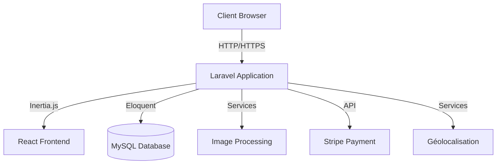

# Marketplace - Documentation Technique

::: tip À propos de cette documentation
Cette documentation technique est destinée aux développeurs, administrateurs système et contributeurs du projet Marketplace. Elle fournit toutes les informations nécessaires pour comprendre, développer et maintenir l'application.
:::

## 🎯 Vue d'ensemble du projet

La Marketplace est une plateforme de commerce électronique spécialisée pour les ressourceries, permettant la vente et l'achat de produits d'occasion. Elle se distingue par :

- Une **gestion avancée des images** avec redimensionnement automatique et optimisation
- Un **système de géolocalisation** des ressourceries
- Une **interface administrative complète** pour la gestion des produits et des utilisateurs
- Un **système de paiement sécurisé** via Stripe

## 🏗️ Architecture Technique



### Stack Technologique

#### Backend
- **Laravel v11.9** - Framework PHP moderne avec une architecture MVC
- **PHP 8.2+** - Dernière version stable de PHP
- **MySQL/MariaDB** - Système de gestion de base de données
- **Stripe** - Intégration pour le traitement des paiements
- **Intervention/Image** - Traitement et optimisation des images

#### Frontend
- **React 18** - Bibliothèque JavaScript pour la construction d'interfaces utilisateur
- **Inertia.js** - Middleware pour créer des applications monolithiques modernes
- **Tailwind CSS** - Framework CSS utilitaire pour le design
- **Leaflet.js** - Bibliothèque de cartographie interactive

#### Outils de Qualité et CI/CD
- **LaraStan (Niveau 5)** - Analyse statique du code PHP
- **Laravel Pint** - Outil de formatage du code PHP
- **StyleCI** - Vérification automatique du style de code
- **Pest** - Framework de test moderne pour PHP

## 🚀 Fonctionnalités Principales

<div class="features">
  <div class="feature">
    <h3>🏪 Gestion des Ressourceries</h3>
    <p>Système complet de gestion des ressourceries avec géolocalisation et profils personnalisés.</p>
    <a href="/ressourceries/">Documentation</a>
  </div>
  
  <div class="feature">
    <h3>📦 Catalogue Produits</h3>
    <p>Gestion avancée des produits avec catégorisation, états, et système de recherche.</p>
    <a href="/products/">Documentation</a>
  </div>
  
  <div class="feature">
    <h3>🖼️ Système d'Images</h3>
    <p>Traitement automatisé des images avec génération de versions optimisées.</p>
    <a href="/images/">Documentation</a>
  </div>

  <div class="feature">
    <h3>💳 Paiements</h3>
    <p>Intégration sécurisée de Stripe avec gestion des transactions.</p>
    <a href="/payments/">Documentation</a>
  </div>
</div>

## 🛠️ Guide d'Installation

### Prérequis
- PHP 8.2 ou supérieur
- Composer 2.x
- Node.js 18.x ou supérieur
- MySQL 8.0 ou supérieur
- Compte Stripe (pour les paiements)
- Clés d'API pour la géolocalisation

### Installation Rapide

```bash
# Cloner le projet
git clone [url-du-repo]
cd marketplace

# Installation des dépendances
composer install
npm install

# Configuration
cp .env.example .env
php artisan key:generate

# Configuration de la base de données et des services
php artisan migrate
php artisan storage:link

# Démarrage
php artisan serve
npm run dev
```

## 📚 Structure du Projet

```
marketplace/
├── app/
│   ├── Http/
│   │   ├── Controllers/    # Contrôleurs par fonctionnalité
│   │   ├── Middleware/     # Middleware personnalisés
│   │   └── Requests/       # Form Requests pour la validation
│   ├── Models/             # Modèles Eloquent
│   ├── Services/           # Services métier (Images, Géoloc, etc.)
│   └── Providers/          # Service Providers
├── resources/
│   ├── js/
│   │   ├── Components/     # Composants React réutilisables
│   │   ├── Layouts/        # Layouts de l'application
│   │   └── Pages/          # Pages React/Inertia par section
│   └── css/               # Styles Tailwind et personnalisés
└── routes/
    ├── web.php            # Routes principales
    └── api.php            # API endpoints
```

## 🔐 Sécurité et Performances

- **Sécurité**
  - Protection CSRF automatique
  - Authentification via Laravel Sanctum
  - Validation stricte des données
  - Gestion sécurisée des uploads
  - Sanitization des entrées utilisateur

- **Performances**
  - Optimisation automatique des images
  - Cache des requêtes de géolocalisation
  - Lazy loading des composants React
  - Indexation optimisée de la base de données

## 📖 Guides Rapides

- [Guide du Développeur](/developer-guide/)
- [Guide d'Administration](/admin-guide/)
- [Guide de Déploiement](/deployment-guide/)
- [Guide de Contribution](/contributing-guide/)

## 🤝 Contribution

Nous encourageons les contributions ! Consultez notre [guide de contribution](/contributing-guide/) pour plus d'informations sur :
- Le processus de Pull Request
- Les standards de code
- Le processus de review
- Les tests requis

<style>
.features {
  display: grid;
  grid-template-columns: repeat(auto-fit, minmax(250px, 1fr));
  gap: 1.5rem;
  margin: 2rem 0;
}

.feature {
  padding: 1.5rem;
  border-radius: 12px;
  background: var(--vp-c-bg-soft);
  transition: all 0.3s ease;
  border: 1px solid var(--vp-c-divider);
}

.feature:hover {
  transform: translateY(-2px);
  box-shadow: 0 4px 12px rgba(0, 0, 0, 0.1);
  border-color: var(--vp-c-brand);
}

.feature h3 {
  margin-top: 0;
  font-size: 1.2rem;
  color: var(--vp-c-brand);
  display: flex;
  align-items: center;
  gap: 0.5rem;
}

.feature a {
  display: inline-block;
  margin-top: 1rem;
  padding: 0.5rem 1rem;
  border-radius: 6px;
  background: var(--vp-c-brand);
  color: white;
  text-decoration: none;
  transition: background 0.3s ease;
  font-weight: 500;
}

.feature a:hover {
  background: var(--vp-c-brand-dark);
}

.tip {
  padding: 1rem;
  border-radius: 8px;
  background: var(--vp-c-bg-soft);
  border-left: 4px solid var(--vp-c-brand);
  margin: 1rem 0;
}
</style> 