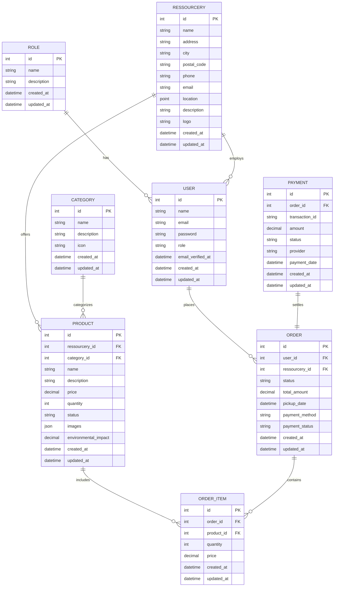

# Modélisation des Données

## Vue d'Ensemble

Ce document présente le modèle conceptuel de données (MCD) du POC PIVOT Marketplace, les entités principales, leurs relations, et leur implémentation dans Laravel. Cette modélisation a été conçue pour répondre aux besoins spécifiques des ressourceries tout en assurant l'évolutivité future du système.

> **Note :** Pour les détails sur les choix technologiques liés à la base de données, consultez la section [Base de Données : MySQL](../matrice_decisionnelle/README.md#base-de-données--mysql) dans la Matrice Décisionnelle.

## Modèle Conceptuel de Données

Le MCD du POC PIVOT comprend huit entités principales, organisées pour représenter les différents aspects du système : utilisateurs, produits, commandes, et ressourceries.

### Diagramme MCD

> **À implémenter :** Le diagramme MCD ci-dessous doit être remplacé par une version graphique plus détaillée, créée avec les outils recommandés dans le [Guide d'Intégration des Diagrammes](../schemas/README.md).



### Description des Entités

#### User (Utilisateur)
Représente tous les utilisateurs du système, avec différents rôles (client, employé de ressourcerie, administrateur).

**Attributs principaux :**
- `id` : Identifiant unique
- `name` : Nom complet
- `email` : Adresse email (utilisée pour l'authentification)
- `password` : Mot de passe hashé
- `role` : Rôle de l'utilisateur (relation avec l'entité Role)

#### Role (Rôle)
Définit les différents rôles et leurs permissions dans le système.

**Attributs principaux :**
- `id` : Identifiant unique
- `name` : Nom du rôle (client, ressourcerie, admin)
- `description` : Description des responsabilités et permissions

#### Ressourcery (Ressourcerie)
Représente les ressourceries partenaires qui proposent des produits sur la plateforme.

**Attributs principaux :**
- `id` : Identifiant unique
- `name` : Nom de la ressourcerie
- `address`, `city`, `postal_code` : Adresse physique
- `location` : Coordonnées géographiques (pour la géolocalisation)
- `description` : Présentation de la ressourcerie
- `logo` : Image du logo

#### Product (Produit)
Représente les articles mis en vente par les ressourceries.

**Attributs principaux :**
- `id` : Identifiant unique
- `ressourcery_id` : Ressourcerie proposant le produit
- `category_id` : Catégorie du produit
- `name` : Nom du produit
- `description` : Description détaillée
- `price` : Prix en euros
- `quantity` : Quantité disponible
- `status` : État du produit (disponible, réservé, vendu)
- `images` : Photos du produit (stockées en JSON)
- `environmental_impact` : Impact environnemental calculé

#### Category (Catégorie)
Classifie les produits par type.

**Attributs principaux :**
- `id` : Identifiant unique
- `name` : Nom de la catégorie
- `description` : Description de la catégorie
- `icon` : Icône représentative

#### Order (Commande)
Représente une commande passée par un client.

**Attributs principaux :**
- `id` : Identifiant unique
- `user_id` : Client ayant passé la commande
- `ressourcery_id` : Ressourcerie concernée
- `status` : État de la commande (en attente, confirmée, prête, récupérée)
- `total_amount` : Montant total
- `pickup_date` : Date de retrait prévue
- `payment_method` : Méthode de paiement
- `payment_status` : État du paiement

#### OrderItem (Élément de Commande)
Représente un produit spécifique dans une commande.

**Attributs principaux :**
- `id` : Identifiant unique
- `order_id` : Commande associée
- `product_id` : Produit commandé
- `quantity` : Quantité commandée
- `price` : Prix unitaire au moment de la commande

#### Payment (Paiement)
Enregistre les informations de paiement pour une commande.

**Attributs principaux :**
- `id` : Identifiant unique
- `order_id` : Commande associée
- `transaction_id` : Identifiant de transaction externe
- `amount` : Montant payé
- `status` : État du paiement
- `provider` : Fournisseur de paiement utilisé

## Implémentation dans Laravel

L'implémentation du modèle de données dans Laravel utilise l'ORM Eloquent pour définir les modèles et leurs relations.

### Exemple de Modèle Eloquent

```php
<?php

namespace App\Models;

use Illuminate\Database\Eloquent\Factories\HasFactory;
use Illuminate\Database\Eloquent\Model;

class Product extends Model
{
    use HasFactory;

    /**
     * Les attributs qui sont assignables en masse.
     *
     * @var array
     */
    protected $fillable = [
        'ressourcery_id',
        'category_id',
        'name',
        'description',
        'price',
        'quantity',
        'status',
        'images',
        'environmental_impact',
    ];

    /**
     * Les attributs qui doivent être castés.
     *
     * @var array
     */
    protected $casts = [
        'price' => 'decimal:2',
        'environmental_impact' => 'decimal:2',
        'images' => 'array',
    ];

    /**
     * Obtenir la ressourcerie qui propose ce produit.
     */
    public function ressourcery()
    {
        return $this->belongsTo(Ressourcery::class);
    }

    /**
     * Obtenir la catégorie de ce produit.
     */
    public function category()
    {
        return $this->belongsTo(Category::class);
    }

    /**
     * Obtenir les éléments de commande pour ce produit.
     */
    public function orderItems()
    {
        return $this->hasMany(OrderItem::class);
    }
}
```

### Migrations

Les migrations Laravel définissent la structure de la base de données et permettent un versioning efficace du schéma.

Exemple de migration pour la table `products` :

```php
<?php

use Illuminate\Database\Migrations\Migration;
use Illuminate\Database\Schema\Blueprint;
use Illuminate\Support\Facades\Schema;

class CreateProductsTable extends Migration
{
    /**
     * Exécuter les migrations.
     *
     * @return void
     */
    public function up()
    {
        Schema::create('products', function (Blueprint $table) {
            $table->id();
            $table->foreignId('ressourcery_id')->constrained()->onDelete('cascade');
            $table->foreignId('category_id')->constrained();
            $table->string('name');
            $table->text('description');
            $table->decimal('price', 8, 2);
            $table->integer('quantity')->default(1);
            $table->string('status')->default('available');
            $table->json('images')->nullable();
            $table->decimal('environmental_impact', 8, 2)->nullable();
            $table->timestamps();
        });
    }

    /**
     * Inverser les migrations.
     *
     * @return void
     */
    public function down()
    {
        Schema::dropIfExists('products');
    }
}
```

## Diagrammes et Schémas Additionnels

> **À implémenter :** Les diagrammes suivants doivent être ajoutés pour compléter la documentation de modélisation :
> 
> 1. **Diagramme de Classes Laravel** - Illustrant la structure des modèles et leurs relations dans le code
> 2. **Schéma de Base de Données** - Montrant les tables, colonnes, clés et index tels qu'implémentés dans MySQL
> 3. **Diagramme de Flux de Données** - Représentant les flux de données entre les différentes entités du système

## Évolutions Futures

Le modèle de données actuel a été conçu pour le POC, mais plusieurs évolutions sont envisagées pour les versions futures :

1. **Gestion des stocks avancée** : Ajout d'attributs pour le suivi des mouvements de stock et l'historique des produits
2. **Système de notation** : Intégration d'un modèle pour les avis et notations des produits et ressourceries
3. **Gestion des promotions** : Structure pour les offres spéciales, codes promotionnels et réductions
4. **Calcul d'impact environnemental** : Enrichissement du modèle pour des calculs plus précis et détaillés
5. **Internationalisation** : Adaptation pour supporter plusieurs langues et devises

## Conclusion

Le modèle de données du POC PIVOT Marketplace fournit une base solide pour les fonctionnalités actuelles tout en permettant une évolution future. La structure relationnelle choisie, implémentée avec Laravel et MySQL, offre un bon équilibre entre performance, flexibilité et facilité de maintenance.

---

*Dernière mise à jour : Février 2025*

[Retour à l'index](../README.md) 